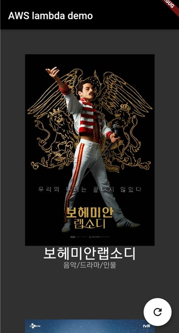

# lambda_test

Demo app for aws lambda function with flutter. 

## Getting Started

### 1. Pub get
you sholud execute 'pub get' to use http library.

### 2. change aws endpoint
you can use my aws endpoint. But you want to use your aws endpoint, change 'aws_endpoint' variable.

### 3. flutter run
run your code.

### 4. result

